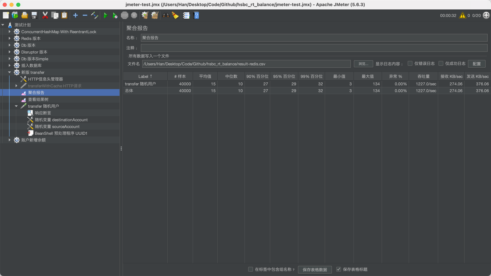

# 高频账户余额更新微服务

假设账户的正确性，合法性等已被上游系统检验过，此服务在内部网络专注于处理高并发的余额更新

账户更新使用微服务架构以应对扩容和容灾的情形。

- **缓存使用**：Redis
- **本地测试数据库**：MySQL
- **阿里云RDS**：使用 PostgreSQL

## 目录结构

- **account-balance**：账户余额服务
- **common-lib**：公共组件（本示例程序没有使用）
- **docs**：压力测试报告
- **k8s**：k8s部署文件（由阿里云效流水线部署到阿里云ACK，连接阿里云RDS和阿里云Redis）
- **deploy.sh**：minikube 部署脚本


## 程序运行与请求方式

程序使用 JDK17，执行 SpringBoot 启动类`AccountBalanceApplication.class` 

启动后，程序监听 8082 端口，程序数据库初始化见`/account-balance/src/main/resources/pgsql.init.sql`

测试开始之前可以通过 `account-balance/src/test/java/com/hsbc/account/GenMockData` 的 `insertAccountBalanceRecords` 方法插入 101 条原始账户数据


#### 接口测试
获得账户1 的余额信息

GET `http://localhost:8082/account/1`

执行转账请求

POST `http://localhost:8082/account:transfer`

```
// 账户 1 向账户 101 转账 1 分钱
{
    "transactionId":"53E02DC369B94F1CB189ED590DB6C2BB",
    "fromAccountId": 1,
    "toAccountId":101,
    "amount":1
}
```

### 阿里云线上部署方法 Deploy
在阿里云效(`https://flow.aliyun.com/`)上建立流水线，指定 kubectl 部署的YAML路径为`k8s/prod/account-balance.yml`，并发布到ACK 集群上。


## 悲观锁

此工程采用悲观锁方案，因为在读写频繁的场景下，乐观锁会给数据库造成额外负担，降低数据库吞吐。

## SQL批量提交执行

采用 `statement.execute()` 执行批量SQL语句，让 `select .. for update` 和具体的 `update` 语句在同一批次交给数据库执行，减少一次与数据库的交互，提高数据库的响应速度。

## 转账操作变为付款和收款两个动作

在这个例子中，我们是单台机器，所以直接执行了两次，两次分两个事务。
在多台机器的时候，收款动作可以根据 hash 值由消息队列交由对应机器处理。
在多台机器的场景，收款和付款的用户很可能涉及多个数据库分库执行，如果一次事务处理就涉及到分布式锁，可能成为性能瓶颈。
将付款和收款分开，通过 Hash 和机器 ID 求余确保同一用户的金额扣减都会在同一机器。

## 采用长整数来避免余额精度问题

用户的余额采用 `Long` 来避免精度问题，100 表示 1 元。

## 单元测试与集成测试

查看 `account-balance` 的 `test` 文件夹。

## 性能测试

在本地单机测试的结果是：20 个线程每个线程发 2000 个请求，Ramp-Up 时间 1s 的情况下，模拟 100 个初始金额 10000 分的用户相互随机转账 1 分的场景，TPS 是 1227（每个请求时间包含写 3 条日志的时间，一条转账信息日志，一条付款成功日志，一条收款成功日志）。执行完毕后，用用户总余额不变来验证程序的并发准确性，请求全部成功并能通过准确性检验。

本地测试机器参数：Mac 2.4GHz 8核心 i9（16-inch 2019 款）32G内存，部署 mysql 和 redis，开启其他很多程序，理论上 TPS 在专用服务器可以更高。

压力测试源文件 `docs/100用户相互之间随机转账压力测试.jmx`

1227TPS 截图


## REDIS 分布式锁方案
使用 Redis 分布式锁可以减轻数据库链接的数量和数据库的直接压力
在与上述性能测试中同样的机器和测试方案下，本 Redis 分布式锁方案的吞吐为 482.7 笔每秒

速度较慢的原因是：
本分布式锁方案在获取锁后执行 SQL 的环节执行了 3 条 SQL，与数据库进行了 3 次交互，还没优化成一次交互形式，
理论上可以快约 2-3 倍，约等于 965.4 - 1448.1 TPS 每秒，

此测试方案对转账的每一步骤状态进行了数据库记录, 如果在数据库悲观锁方案中在更新余额的时候同时更新 transfer_log 的 status, TPS 大概变为 840

因此大规模集群部署的生产环境中 `Redis分布式锁方案` 应该可以取得更好的效果，同时还能防止数据库被高并发直接压垮。

Redis分布式锁方案482.7TPS截图


